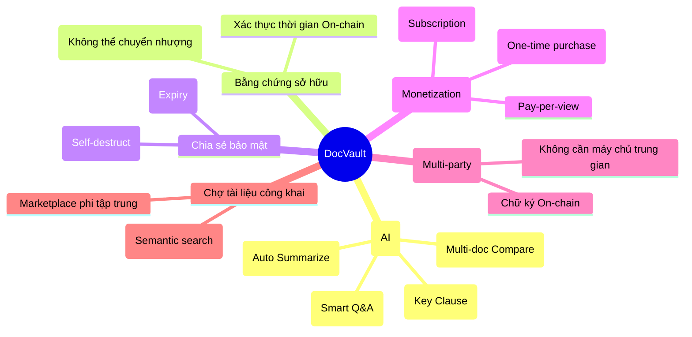
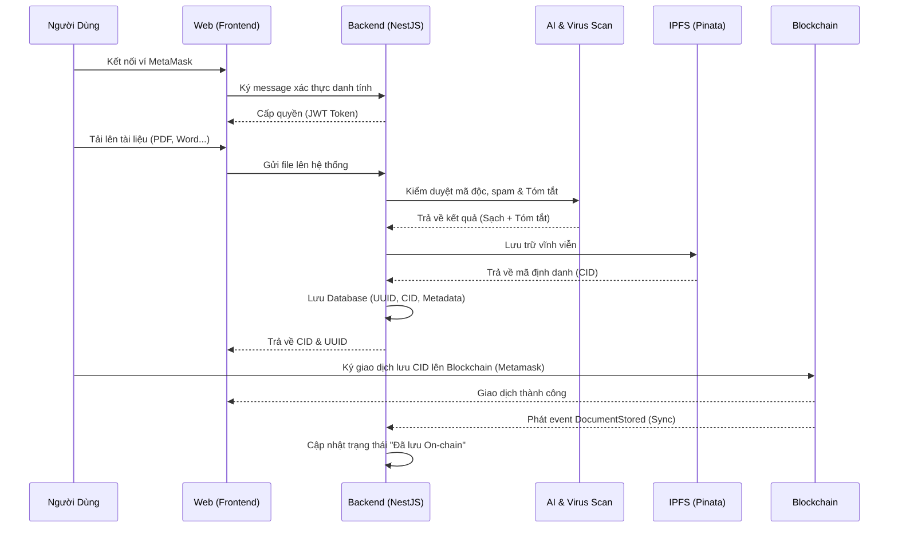

# Web3 Document Storage Platform (DocVault)

Hệ thống lưu trữ và quản lý tài liệu phi tập trung tích hợp AI, nơi mỗi tài liệu của người dùng được mã hóa, xác thực bởi AI, lưu trữ vĩnh viễn trên IPFS và được xác nhận chủ quyền trên Blockchain.

## 1. Tóm tắt hệ thống & Sơ đồ (Dành cho người dùng)

### Bản đồ tính năng (Feature Map)

Hệ thống xoay quanh 6 nhóm tính năng cốt lõi:

### Sơ đồ luồng hoạt động (User Operations)

Dưới đây là luồng hoạt động của Phase 1 (Upload + AI Scan + IPFS + Blockchain):

---

## 2. Kế hoạch triển khai Backend - Phase 1 (MVP)

Backend hiện tại đã được khởi tạo bằng NestJS với các dependency cần thiết (TypeORM, Postgres, Anthropic, Pinata, Ethers). Chúng ta sẽ xây dựng các modules sau:

### Cơ sở dữ liệu (PostgreSQL + TypeORM)

#### [NEW] `src/modules/users/entities/user.entity.ts`

- `wallet_address` (PK): Địa chỉ ví
- `nonce`: Dùng để ký xác thực đăng nhập (thay đổi sau mỗi lần login)
- `created_at`: Thời gian tạo

#### [NEW] `src/modules/documents/entities/document.entity.ts`

- `id` (UUID - PK): Định danh off-chain
- `wallet_address` (FK): Chủ sở hữu
- `title`: Tên tài liệu
- `cid`: Content ID trên IPFS
- `ai_summary`: Tóm tắt nội dung từ AI
- `tags`: Dạng chuỗi hoặc array
- `is_ai_verified`: Trạng thái kiểm duyệt
- `is_onchain`: Đã được lưu trên smart contract chưa
- `status`: Pending, Processed, Failed
- `created_at` / `updated_at`

### Authentication Module (Web3 Auth)

#### [NEW] `src/modules/auth/...`

- **Flow**: Frontend gọi API `/auth/nonce/:wallet` để lấy mã nonce. Sau đó người dùng dùng ví MetaMask để ký mã nonce này và gọi `/auth/verify`.
- **Verify**: Sử dụng `ethers.verifyMessage()` để kiểm tra chữ ký. Nếu hợp lệ, cấp JWT.

### Documents Module (Cốt lõi Phase 1)

#### [NEW] `src/modules/documents/...`

- **API `/documents/upload`**:
  1. Nhận file qua `multer`.
  2. Gửi file text/nội dung qua **Anthropic API (Claude)** để kiểm duyệt nội dung, trích xuất tóm tắt và tự động gán tags.
  3. Nếu AI đánh giá an toàn, đẩy file lên **IPFS qua Pinata**.
  4. Lưu thông tin (UUID, CID, AI Summary) vào Database và trả về cho Frontend.
- **API `/documents`**: Lấy danh sách tài liệu của user đang đăng nhập.

### Blockchain Sync Module (Tuỳ chọn)

#### [NEW] `src/modules/blockchain/...`

- Sử dụng thư viện `ethers` để lắng nghe event `DocumentStored` từ Smart Contract `DocVaultStorage.sol`. Khi phát hiện sự kiện, cập nhật cột `is_onchain = true` trong database.

---

> [!IMPORTANT]
> **Câu hỏi chờ xác nhận từ bạn (Open Questions):**
>
> 1. chỉ cần bản tiêu chuẩn
> 2. Backend tự listen qua Event sẽ bảo mật hơn
> 3. đã có nằm trong .env ở contracts hay check và sử dụng

Kế hoạch triển khai Frontend & Backend - Phase 2 (Intelligence)
Trong Phase 2, chúng ta sẽ mở rộng khả năng xử lý AI (Hỏi đáp, Trích xuất, So sánh) và xây dựng giao diện trực quan cho người dùng.

A. Backend (NestJS)
[NEW] Endpoint Hỏi Đáp (Smart Q&A - RAG Pipeline)
API: POST /documents/:id/chat
Chức năng: Nhận câu hỏi từ người dùng, đọc nội dung file gốc hoặc AI Summary, và sử dụng Anthropic Claude để trả lời (như "Hợp đồng này hết hạn ngày nào?").
Lưu ý: Ở bản MVP, ta có thể nhúng trực tiếp toàn bộ text vào prompt. Nếu file quá dài, ta sẽ cần thêm pgvector.
[NEW] Endpoint So sánh tài liệu (Multi-doc Compare)
API: POST /documents/compare
Chức năng: Nhận 2 ID tài liệu, yêu cầu AI phân tích điểm khác biệt (highlight thay đổi, điều khoản mới/cũ).
[NEW] Endpoint Trích xuất điều khoản (Key Clause Extractor)
API: GET /documents/:id/clauses
Chức năng: Prompt AI tìm kiếm và trả về mảng các điều khoản quan trọng (Ví dụ: "Điều khoản phạt", "Điều khoản thanh toán").
B. Frontend (React + Vite + TailwindCSS)
Chúng ta sẽ xây dựng một giao diện MVP bằng React (Vite) và Tailwind v4.

[NEW] Dashboard Page: Liệt kê các tài liệu đã tải lên dưới dạng Grid/Table. Có nút "Tải lên tài liệu mới".
[NEW] UploadModal Component: Cho phép kéo thả file, hiển thị trạng thái đang scan bởi AI và upload lên IPFS.
[NEW] DocumentViewer Component: Mở tài liệu lên để xem (hiển thị text hoặc PDF preview).
[NEW] AIChatSidebar Component: Một thanh chat bên phải màn hình khi đang xem tài liệu để người dùng hỏi đáp trực tiếp với tài liệu.
[NEW] CompareModal Component: Chọn 2 tài liệu từ Dashboard và hiển thị bảng so sánh side-by-side do AI tạo ra.
IMPORTANT

Câu hỏi chờ xác nhận cho Phase 2:

Về tính năng RAG (Smart Q&A), do file có thể rất dài, cài đặt thư viện pgvector
Giao diện Frontend (React): Bạn có muốn tôi sử dụng bộ component UI nào (như shadcn/ui, Radix UI) để xây dựng nhanh các bảng biểu và modal không, hay code Tailwind thuần- Phương án nào tốt thì làm
Trong Phase 2 này, tôi sẽ ưu tiên code các UI Component (trên Frontend) trước để bạn có hình dung trực quan nhất, sau đó kết nối với API backend. Bạn đồng ý với cách tiếp cận này chứ?
Vui lòng xem và cho tôi phản hồi để tôi bắt đầu code Phase 2!

Now Plan
Đủ thông tin rồi. Mình sẽ phân tích và vẽ toàn bộ feature map + kiến trúc cho Zane.
::view-transition-group(_),
::view-transition-old(_),
::view-transition-new(\*) {
animation-duration: 0.25s;
animation-timing-function: cubic-bezier(0.19, 1, 0.22, 1);
}
VvisualizeVvisualize show_widget
Chi tiết từng nhóm tính năng / Feature breakdown

Nhóm 1 — File + Folder tree (như Google Drive)
DB Schema cần thêm:
sql-- Thêm vào bảng documents hiện tại
ALTER TABLE documents ADD COLUMN parent_folder_id UUID REFERENCES folders(id);
ALTER TABLE documents ADD COLUMN is_starred BOOLEAN DEFAULT false;
ALTER TABLE documents ADD COLUMN deleted_at TIMESTAMPTZ; -- soft delete

-- Bảng mới: folders
CREATE TABLE folders (
id UUID PRIMARY KEY DEFAULT gen_random_uuid(),
name TEXT NOT NULL,
parent_id UUID REFERENCES folders(id), -- nested folders
owner_wallet TEXT NOT NULL,
created_at TIMESTAMPTZ DEFAULT NOW()
);

-- Bảng mới: version history
CREATE TABLE document_versions (
id UUID PRIMARY KEY DEFAULT gen_random_uuid(),
document_id UUID REFERENCES documents(id),
version_num INT NOT NULL,
ipfs_cid TEXT NOT NULL, -- CID của version này
tx_hash TEXT, -- on-chain proof nếu cần
created_at TIMESTAMPTZ DEFAULT NOW()
);

Nhóm 2 — Share + Permission (như Google Drive)
Google Drive có 5 level: Manager → Content Manager → Contributor → Commenter → Viewer. DocVault map thành:
typescript// permission.entity.ts
enum PermissionLevel {
OWNER = 'owner', // full control
EDITOR = 'editor', // read + write
COMMENTER = 'commenter', // đọc + comment (AI Q&A)
VIEWER = 'viewer', // chỉ xem
}

// share.entity.ts
@Entity('shares')
export class Share {
@Column() targetWallet: string; // ví được share
@Column() targetEmail: string; // hoặc email thường
@Column() resourceId: string; // document/folder id
@Column() resourceType: 'file'|'folder';
@Column() permission: PermissionLevel;
@Column({ nullable: true }) expiresAt: Date; // hết hạn tự động
@Column({ nullable: true }) password: string; // bảo vệ bằng password
@Column() token: string; // UUID cho share link
@Column({ default: true }) isActive: boolean;
}

Nhóm 3 — UX tính năng cần có
Tính năngGoogle Drive làm saoDocVault làm saoPreview fileMở inline trong browserreact-pdf cho PDF,  cho ảnh, mammoth.js cho DOCXSearchFull-text search theo tênPostgreSQL tsvector + AI semantic searchStarredClick ngôi saois_starred = true trong DBRecentXem file gần đâyORDER BY last_accessed_at DESCTrashXóa mềm 30 ngàydeleted_at IS NOT NULL → filter raDrag & dropKéo vào folderreact-dnd hoặc dnd-kitRight-click menuContext menuCustom dropdown componentGrid / List viewToggle layoutState `viewMode: 'grid'
